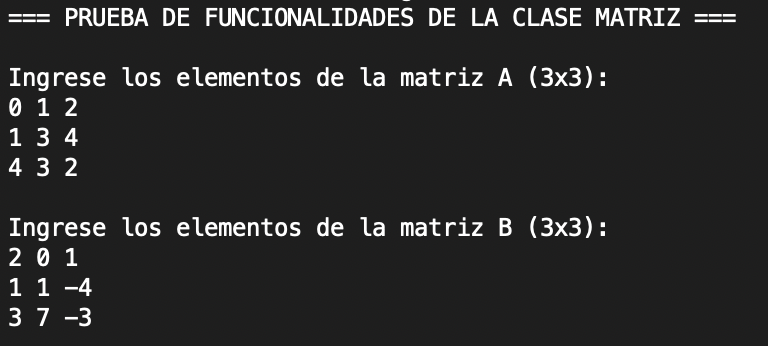
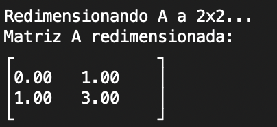
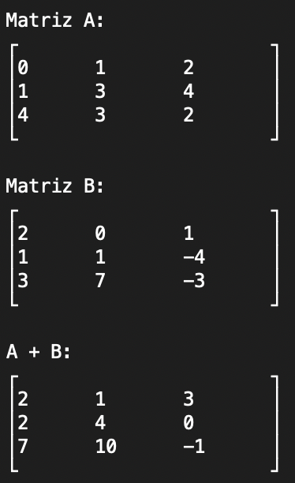
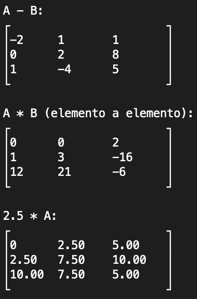
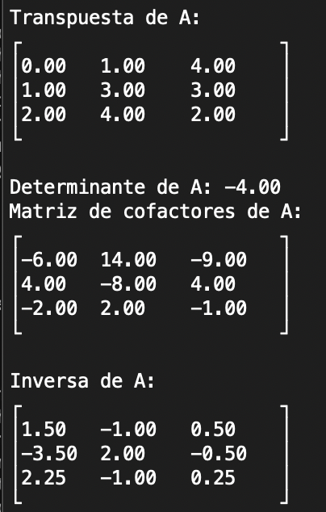

# Algebraic Matrix

**Algebraic Matrix** es una biblioteca en C++ que permite crear, manipular y operar con matrices algebraicas de tipo `long double`. Incluye funcionalidades como suma, resta, multiplicación, transposición, cálculo de determinantes, cofactores, inversa y redimensionamiento.

Este proyecto fue desarrollado como parte de mis estudios en estructuras algebraicas y está documentado completamente con Doxygen.

---
<table>
    <tr>
        <th></th>
        <th></th>
    </tr>
    <tr>
        <th></th>
        <th></th>
        <th></th>
    </tr>
  
</table>

## Funcionalidades principales

- Creación y captura de matrices dinámicas
- Suma, resta y multiplicación (elemento a elemento)
- Transposición
- Determinante
- Matriz de cofactores
- Inversa (cuando existe)
- Redimensionamiento de matrices
- Sobrecarga de operadores `+`, `-`, `*`, `<<`, `>>`

---
## Documentación
La documentación completa generada con Doxygen está disponible en GitHub Pages:

- https://ana-chenoweth.github.io/algebraic-matrix/


## Compilación en macOS / Linux
Asegúrate de tener g++ o clang++ instalado.

```
clang++ -std=c++17 -Wall -o matriz main.cpp Matriz.cpp
./matriz
```

## Tecnologías utilizadas
- Lenguaje: C++17
- Documentación: Doxygen
- Publicación: GitHub Pages

## Autor
**Ana Laura Chenoweth Galaz**
Este proyecto forma parte de mi portafolio profesional como desarrolladora e investigadora en ciencias computacionales.

## Licencia
Este proyecto está bajo la licencia MIT. Consulta el archivo LICENSE para más detalles.
